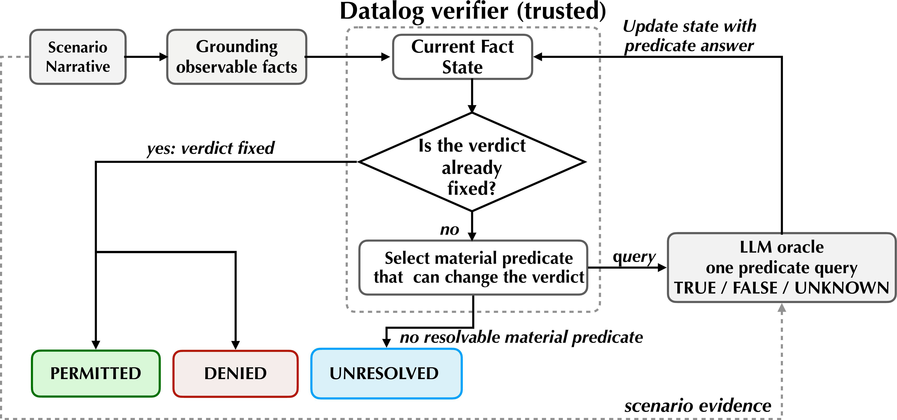
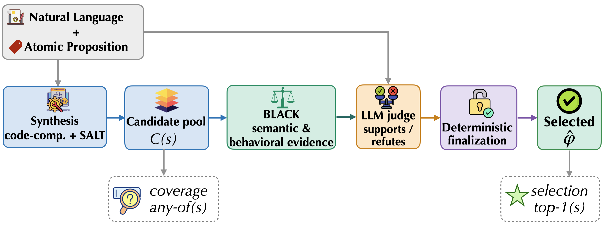
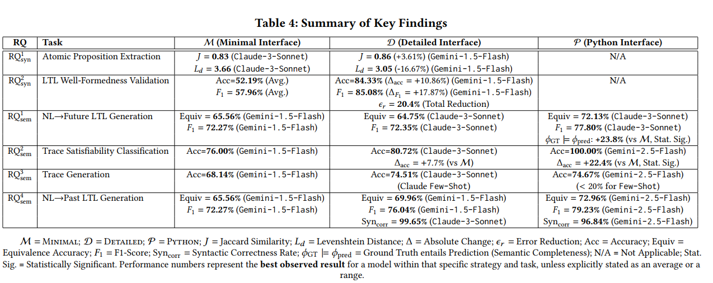

<h2 style="margin: 60px 0px 10px;">About Me</h2>

I am a **PhD candidate** in Computer Science at [Stony Brook University](https://www.cs.stonybrook.edu/), advised by [Dr. Omar Chowdhury](https://www3.cs.stonybrook.edu/~omar/). My research **combines LLMs with symbolic analysis and reasoning**: LLMs translate natural language into formal logic, and symbolic tools verify, select, and decide. This reduces hallucination and gives formal tools a natural-language interface. I apply it to temporal-logic specification (**SecDev '26**; under review at **ICLR 2027**) and HIPAA compliance checking (**ATHENA**; under review at **PoPETs 2027**).

Previously, I completed my M.Sc. at the University of New Brunswick under [Dr. Ali Ghorbani](https://www.unb.ca/faculty-staff/directory/computer-science/ghorbani-ali.html); my IoT device profiling work has been **cited over 220 times**.

## Research Interests

- **Formal Verification & Specification Synthesis:** Natural-language-to-Linear-Temporal-Logic (LTL) translation
- **LLM Safety & Evaluation:** Systematic evaluation of LLM-generated formal specifications
- **Neural-Symbolic AI:** Combining neural networks with symbolic reasoning for trustworthy systems
- **Regulatory Compliance:** Verifier-controlled compliance checking against a Datalog formalization of HIPAA; multi-regulatory extensions (e.g., GDPR) are an early-stage direction I'm exploring next
- **Agentic AI Systems:** Autonomous reasoning with self-correction and explainability

  <h2 style="color: #e74d3c; font-weight: 600; margin-bottom: 10px;">
    🔍 Seeking Summer 2027 Research Internship Opportunities
  </h2>
  

    I am actively seeking <strong>Research Scientist Internship</strong> positions for <strong>Summer 2027</strong> in:
    <strong>AI Safety</strong> • <strong>Formal Verification</strong> • <strong>Privacy Compliance</strong> • <strong>Trustworthy AI</strong>
  

  

    📧 <a href="mailto:pdanso@cs.stonybrook.edu">pdanso@cs.stonybrook.edu</a> • 
    💻 <a href="https://github.com/priscilla100" target="_blank">GitHub</a> • 
    📚 <a href="https://scholar.google.com/citations?user=bPvjbUMAAAAJ&hl=en" target="_blank">Google Scholar</a>
  

  

    <a href="./assets/Priscilla_Kyei_Danso_CV.pdf" target="_blank" class="resume-button">
      📄 Download CV
    </a>
    <a href="./assets/2025_Research_summary.pdf" target="_blank" class="resume-button">
      📝 Research Summary
    </a>
  



## Featured Research

### ⚖️ ATHENA: Verifier-Controlled HIPAA Compliance

**ATHENA** studies how large language models can assist with regulatory compliance without giving the language model control over the compliance decision.

Given a question such as *“Is this disclosure of protected health information permitted under HIPAA?”*, ATHENA uses a machine-checked **Datalog encoding of the HIPAA Privacy Rule**, executed in [Soufflé](https://souffle-lang.github.io/). Rather than asking an LLM to extract every potentially relevant fact upfront, the verifier determines which unresolved fact can still affect the current policy proof and asks an LLM evidence oracle about that fact. The oracle returns `TRUE`, `FALSE`, or `UNKNOWN`.

A key design principle is that **missing evidence remains missing**. An `UNKNOWN` response is preserved as `UNRESOLVED` rather than silently treated as `FALSE`. This separates evidence acquisition from policy decision-making: the LLM supplies evidence, while the formal verifier determines which evidence is relevant and whether the policy establishes a permitted or denied outcome.

ATHENA is currently scoped to HIPAA and is being evaluated across real-world disclosure scenarios and multiple language models. A future direction I am exploring is **multi-regulatory compliance**, where a single data-use scenario may fall under overlapping frameworks—for example, a U.S. healthcare setting in which HIPAA and GDPR obligations may both become relevant. This direction is exploratory and has not yet been implemented.

**PoPETs 2027 (Issue 2): advanced to Round 2 of review.**

### 🎯 Generation Is Not Selection: Neuro-Symbolic Formalization of Temporal Logic

A natural-language requirement can admit several plausible temporal-logic formalizations, so generating a correct candidate is not the same as selecting the intended one. **Pendulum** separates candidate synthesis from symbolic semantic analysis and final selection: solver-backed (BLACK) equivalence and behavioral evidence is assessed by an LLM judge, and deterministic finalization commits to one formula.

On the `nl2ltl` benchmark, after auditing all 306 references (55 corrected, 48 ambiguous specifications kept as a separate partition), the strongest candidate pool contains a correct formula for **92.2%** of the 258 determinate specifications, but the final system selects one correctly for **87.2%**. This coverage-to-selection gap persists across changes to synthesis, verification, and selection.

**Under review at ICLR 2027** · [OpenReview](https://openreview.net/forum?id=08AFwZWnnv)

### 📊 Syntax Is Easy, Semantics Is Hard: Evaluating LLMs for LTL Translation

A multi-dimensional evaluation framework that scores LLM-generated temporal logic on syntactic well-formedness, semantic equivalence, and trace-based behavior. Best-observed equivalence accuracy on NL→LTL translation stays around 65–73% across prompting interfaces, which motivates keeping symbolic tools in the loop, as in the two projects above. Published at [ACM SecDev '26](https://dl.acm.org/doi/10.1145/3805773.3806005).

---

## Selected Publications

**[Under Review, ICLR 2027]** **P.K. Danso**, et al. "Generation Is Not Selection: Neuro-Symbolic Natural Language Formalization of Temporal Logic". [OpenReview](https://openreview.net/forum?id=08AFwZWnnv)

**[Under Review, PoPETs 2027 · Round 2]** **P.K. Danso**, et al. "ATHENA: Answering Regulatory Permissibility Questions through Iterative Fact Finding"

**[SecDev '26]** **P.K. Danso**, et al. "Syntax Is Easy, Semantics Is Hard: Evaluating LLMs for LTL Translation". *Proceedings of the 2026 ACM Secure Development Conference*.

**[IoT-J 2023]** **P.K. Danso**, S. Dadkhah, E.C.P. Neto, et al. "Transferability of Machine Learning Algorithms for IoT Device Profiling and Identification". *IEEE Internet of Things Journal*, 2023.

**[PST 2022]** S. Dadkhah, H. Mahdikhani, **P.K. Danso\***, et al. "Towards the Development of a Realistic Multidimensional IoT Profiling Dataset". *IEEE PST*, 2022. (**220+ citations**)

*\*Equal contribution*

[Full publication list →](./publications/)

---

## Professional Service

- **Artifact Evaluation Committee**: IEEE S&P 2027, USENIX Security 2025, ACM CCS 2024
- **Paper Reviewer**: IEEE Internet of Things Journal (2023–Present)
- **Vice President** (previously Secretary), Women in Ph.D. in Computer Science (WPhD), Stony Brook University (2024–Present)
- **Mentor**: Center for Inclusive Education, Stony Brook University (2025–Present); Women in Computer Science, Stony Brook University (2024–Present)

[Full service list →](./services/)

## Honors & Awards

- **SREB Institute on Teaching and Mentoring**, selected participant (2024, 2025)
- **NSF Summer School on Formal Techniques** + FMiTF Bootcamp (May 2024)
- **CPS-IoT Week 2024** Student Travel Award, Hong Kong (NSF-sponsored, April 2024)
- **iMentor Scholarship** for ACM CCS, Copenhagen, Denmark (NSF-sponsored, Nov 2023)
- **Academic Scholarship**, University of New Brunswick (May 2021)
- **Academic Scholarship**, Newmont Ahafo Development Foundation, Ghana (Sep 2016)

## Teaching

**Teaching Assistant**, Stony Brook University:
- **CSE 312.01 / ISE 312.01**: Social, Legal, and Ethical Issues in Computing (Fall 2026)
- **ISE 331**: Fundamentals of Computer Security (Spring 2024)
- **CSE 331**: Computer Security Fundamentals (Fall 2023)

---

## Let's Connect

**Interested in collaborating?**

**📧 Email**: [pdanso@cs.stonybrook.edu](mailto:pdanso@cs.stonybrook.edu)  
**💼 LinkedIn**: [linkedin.com/in/priscilla-kyei-danso](https://www.linkedin.com/in/priscilla-kyei-danso/)  
**💻 GitHub**: [github.com/priscilla100](https://github.com/priscilla100)  
**📚 Google Scholar**: [citations?user=bPvjbUMAAAAJ](https://scholar.google.com/citations?user=bPvjbUMAAAAJ&hl=en)

---

*Last updated: September 2026*

